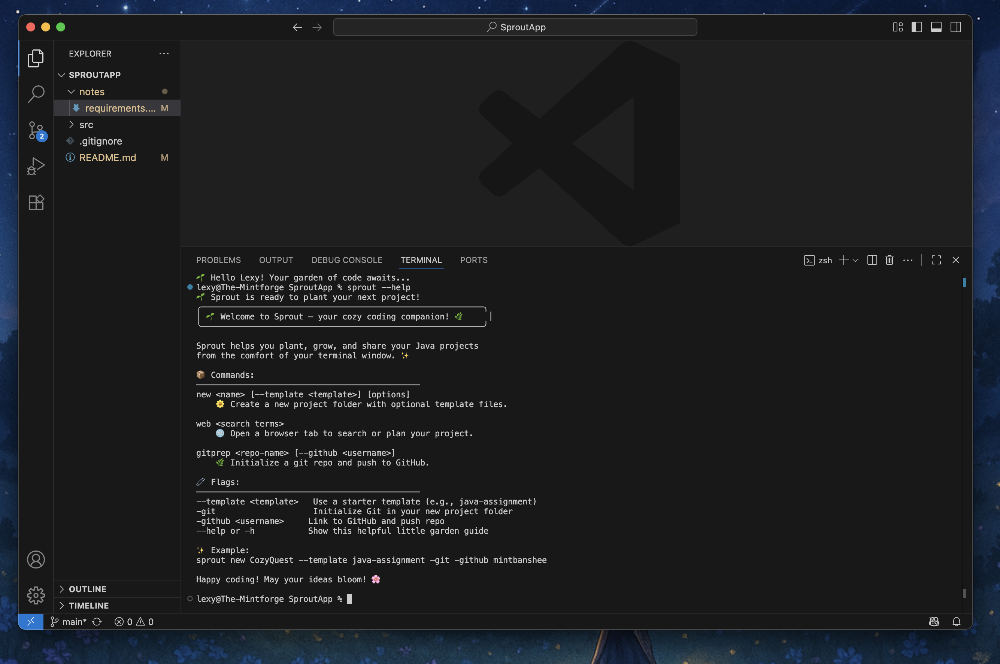
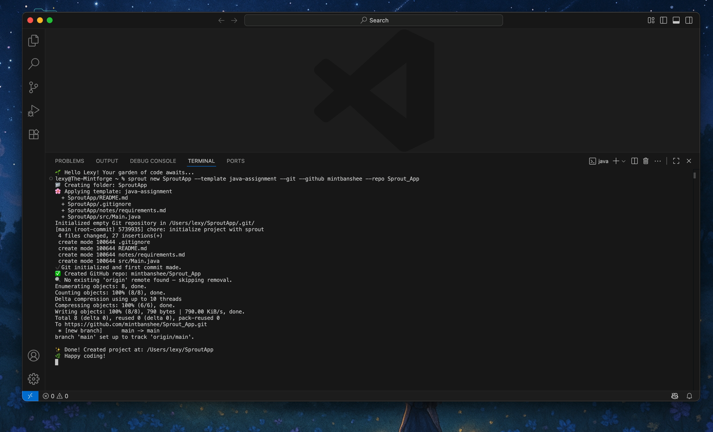
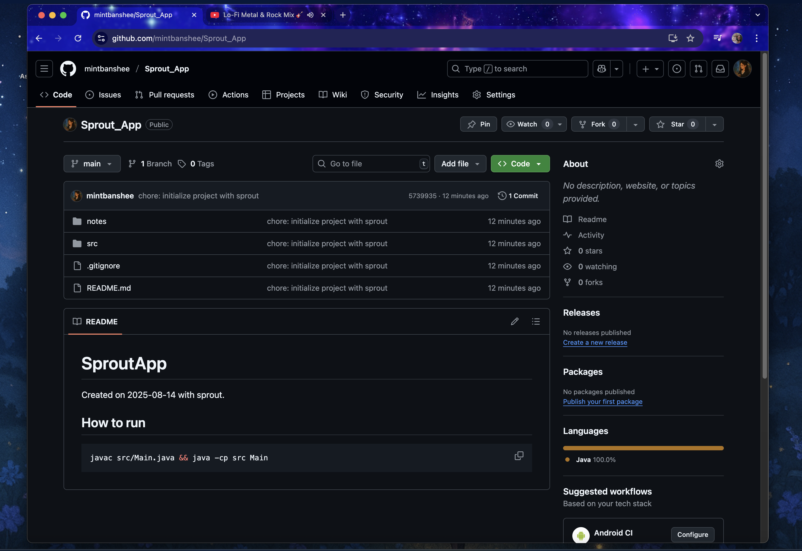

# SproutApp

# 🌱 SproutApp

SproutApp is a cozy Java-based CLI tool designed to quickly scaffold project templates for developers. With a few simple flags, you can generate structured folders, starter files, and even auto-initialize a Git repository with optional GitHub integration — perfect for students and devs who want to skip the setup and jump straight into coding.

Created with 🌿 by Alexandria (MintBanshee) as part of a Java assignment at triOS College.

---

## ✨ Features

- 📁 Generate new projects using templates like `java-assignment`, `web-basic`, or `swift-assignment`
- 🌱 Optional Git + GitHub initialization with first commit
- 🔗 Auto-link to remote GitHub repo
- 📂 Opens your project folder in VS Code when done
- 🎯 Simple, clean CLI experience with emoji feedback

---

## 🛠️ How to Run

To compile and run SproutApp from the terminal:

```bash
javac src/Main.java && java -cp src Main

Once compiled, you can use it from the command line like this:

sprout new MyProject --template java-assignment --git --github yourUsername --repo MyProject

&nbsp;

---

💻 Installation

1. Clone or download this repository
2. Open in VS Code or your terminal of choice
3. Compile the app using:
  javac src/Main.java
4. Run it
  java -cp src Main

Optional: You can bundle the app into a JAR and alias it for easier use

---

📷 Screenshots

### 🌱 Help Screen


### 🌱 Created Project with Template & Repo


### 🌱 GitHub Repo View


---

📖 Wiki

A full breakdown of how SproutApp works — including commands, flags, and templates — is available in the Wiki.

🧠 Assignment Details

This project was created as part of Java Assignment 4, which asked students to:

✅ Create a useful Java application

✅ Run it from terminal or icon

✅ Set up GitHub repo named after the app

✅ Include a README and wiki

✅ Add screenshots (and optionally a video)

---

🌸 About the Developer

Lexy (aka MintBanshee) is a web & app development student with a love for cozy code, thoughtful UX, and building tools that make life easier. This is her first Java app, and it’s just the beginning! 🌿✨

---

🪴 License

This project is open-source and free to use for learning purposes.
